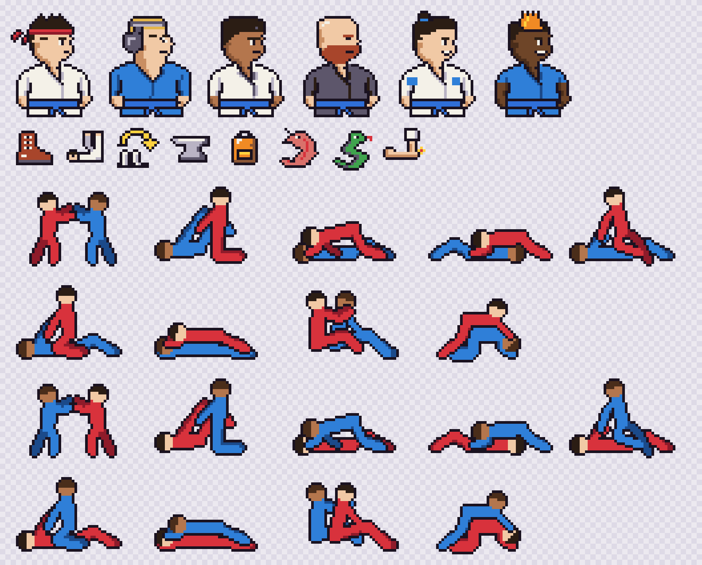

# Guard to Sub: the art, for sign-off

Drawn 2026-10-06 for step 6. Regenerate the sheet with `npx tsx scripts/art-sheet.ts` after any
change to `src/games/guard/art/`. Belts render in today's colour; the sheet shows blue.

**Row 1, portraits (32x40):** your fighter (the hero: red headband, white gi), then the opponents in
`ARCHETYPES` order: Ex-D1 wrestler (headgear, blue gi), Judo black belt (side part, heavy collar),
Leg-lock specialist (bald, ginger beard, black gi), Guard player (top knot, sponsor patches),
Scrambler (mohawk, rolled sleeves). All face right; the VS screen mirrors the opponent.

**Row 2, stat icons (16x16)**, in `STATS` order: Standing (a wrestling boot), Guard (on your back,
feet up), Passing (an arrow vaulting the knees), Top control (an anvil, for pressure), Back (a
backpack: "taking the backpack"), Escapes (a shrimp, the hip escape), Chokes (a snake: anaconda and
python chokes), Joint locks (a bent arm, a pop at the elbow).

**Rows 3 to 6, position scenes (48x32)**, you in red: standing, guard, side control, north-south,
knee on belly (row 3), mount, back mount, back control, turtle (row 4), all with you on top; rows 5
and 6 repeat them with you underneath. One scene per position *kind*: every guard (closed, open,
half, butterfly, De la Riva, X, single-leg X) shares the guard scene, and the screen names the exact
position under it. The replay tweens between scenes, so a sweep shows red rolling from bottom to top.

## Sign-off (Joshua)

- [ ] Each opponent reads as their archetype at phone size.
- [ ] Each icon reads as its stat, or at least won't mislead once its name is beside it.
- [ ] Each scene is the right position to a grappler (the weakest: side control, north-south and
      back mount look alike from the side; each is captioned).

## How it was drawn (for rebuilding it)

- Portraits and icons are text grids (`sprites/*.ts`), one palette key per pixel, checked by
  `art.test.ts` (sizes, palette, a belt on every portrait, an icon for every stat).
- Scenes are poses (`rig.ts`): 11 joints per fighter, rasterised with thick limbs, far limbs a shade
  darker, a 1-pixel outline painted over whoever is underneath so the bodies separate.
- Haiku was tried first, through a `pixel-draw` render-and-critique tool in the offload plugin, and
  measured: the wrestler took 6 minutes and 42k output tokens and came back a recolour of the hero;
  the chokes icon came back a blob twice (10 s with thinking off, 8.8 minutes and 59k tokens with it
  on). Drawing by hand cost about 1.5k tokens a portrait. DECISIONS 2026-10-06 has the details.
