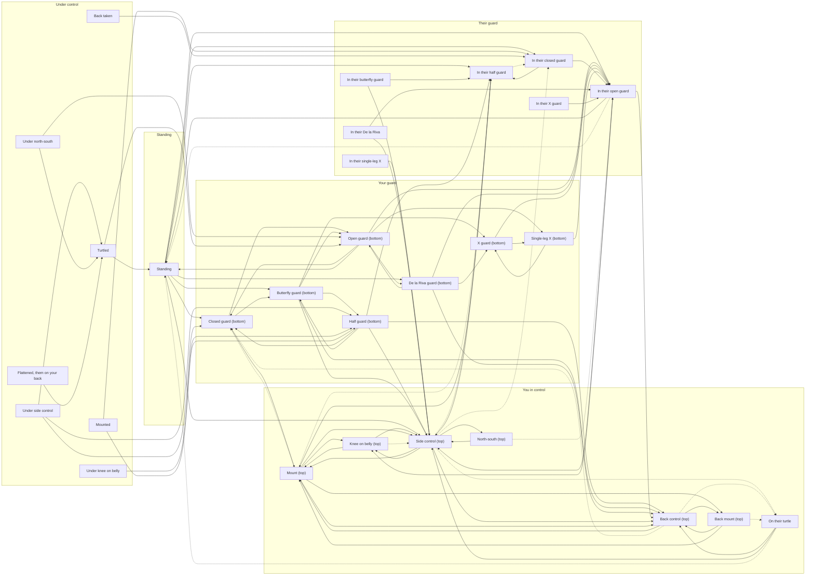

# Guard to Sub: position graph

<!-- Generated from src/games/guard/graph.ts by `npx tsx scripts/graph-doc.ts`. Don't edit by hand. -->

Awaiting Joshua's sign-off. 29 positions, 85 techniques, 13 opponent moves, 38 submissions. `npx tsx scripts/check-graph.ts` checks it.

## How to read it

- **You're always the player.** "Top" positions are the ones you control (on top in their guard,
  on their back); "bottom" ones have you controlled.
- **Start-only** positions can't be reached from standing, because only the opponent's offense gets
  you there and the opponent doesn't attack. A puzzle can start in one (a comeback, say).
- **Their moves** are the opponent's escapes and guard plays. They score nothing, and in scoring
  they wipe the memory of what you last scored (RULES.md, choice 1). Step 5's daily opponent decides
  which ones happen.
- **Points** is what the move pays if the position you're leaving was the last one you scored. In a
  real line `rules.ts` decides, so the same move can pay less (stepping down from mount to knee on
  belly pays 0).

## Which moves score

Every move lists its events, and `graph.check.ts` re-derives them from the two positions, so a
move that disagrees fails the check unless it explains why.

| Move | Events | Source |
|---|---|---|
| standing to any top position | takedown | 4.1.1, 4.1.2 |
| bottom of a guard to any top position, the back included | sweep | 4.6.1, 4.6.2 |
| top of a guard to side control, north-south, knee on belly or mount | guard pass | 4.2, 3.4 |
| arriving on top in knee on belly, mount, back mount or back control | that position, added | 3.4, 4.3 to 4.5 |
| reversals from a pin or turtle, pulling guard, their moves | none | 4.6 (a sweep starts in guard), choice 5 |

Exceptions with a reason: none.

## Belts

Submissions are gi, adult. The rule book's illegal-moves table (p.29, 6.2.3 M) sets the lowest belt
for each hold it lists; anything it doesn't list is legal for all adults. Heel hooks and knee
reaping are illegal in the gi at every belt, so they're not here. Rows used:

| Row on p.29 | Lowest belt | Used by |
|---|---|---|
| Frontal guillotine choke | white | `standing-guillotine`, `closed-guard-guillotine`, `butterfly-guillotine` |
| Omoplata | white | `closed-guard-omoplata` |
| Wrist lock | blue | `closed-guard-wrist-lock` |
| Straight foot lock | white | `x-guard-ankle-lock`, `single-leg-x-ankle-lock`, `open-guard-top-ankle-lock`, `single-leg-x-top-ankle-lock` |
| Toe hold | brown | `single-leg-x-toe-hold` |
| Knee bar | brown | `single-leg-x-knee-bar` |
| Forearm choke using the sleeve (Ezequiel choke) | white | `closed-guard-top-ezekiel`, `mount-ezekiel` |
| Arm triangle | white | `half-guard-top-arm-triangle`, `side-arm-triangle`, `mount-arm-triangle` |

## Map

Solid arrows are your moves, dotted ones the opponent's. Submissions aren't drawn.

## Positions and moves

### Standing

`standing`. Also called: em pé.

| Move | To | Events | Points |
|---|---|---|---|
| Pull guard (puxar para a guarda) | Closed guard (bottom) | none | 0 |
| Sit to butterfly guard | Butterfly guard (bottom) | none | 0 |
| Pull to De la Riva | De la Riva guard (bottom) | none | 0 |
| Double leg (baiana) | In their closed guard | takedown | 2 |
| Double leg, landing past the legs | Side control (top) | takedown | 2 |
| Single leg | In their half guard | takedown | 2 |
| Ankle pick | In their open guard | takedown | 2 |
| Osoto gari | Side control (top) | takedown | 2 |
| Seoi nage | Side control (top) | takedown | 2 |

Submissions: Standing guillotine (all belts).

### Closed guard (bottom)

`closed-guard-bottom`. Also called: full guard, guarda fechada.

| Move | To | Events | Points |
|---|---|---|---|
| Scissor sweep (raspagem de tesoura) | Mount (top) | sweep + mount | 6 |
| Hip bump sweep | Mount (top) | sweep + mount | 6 |
| Flower sweep (pendulum sweep, raspagem de pêndulo) | Mount (top) | sweep + mount | 6 |
| Open the guard | Open guard (bottom) | none | 0 |
| Switch to butterfly hooks | Butterfly guard (bottom) | none | 0 |

Submissions: Armbar (all belts), Triangle (all belts), Omoplata (all belts), Cross collar choke (all belts), Kimura (all belts), Guillotine (all belts), Wrist lock (blue belt and up).

### Open guard (bottom)

`open-guard-bottom`. Also called: guarda aberta.

| Move | To | Events | Points |
|---|---|---|---|
| Tripod sweep | In their open guard | sweep | 2 |
| Sickle sweep | In their open guard | sweep | 2 |
| Close the guard | Closed guard (bottom) | none | 0 |
| Hook De la Riva | De la Riva guard (bottom) | none | 0 |
| Enter single-leg X | Single-leg X (bottom) | none | 0 |
| Technical stand-up | Standing | none | 0 |

Submissions: Triangle (all belts).

### Half guard (bottom)

`half-guard-bottom`. Also called: meia guarda.

| Move | To | Events | Points |
|---|---|---|---|
| Old school sweep | In their half guard | sweep | 2 |
| Deep half waiter sweep | Side control (top) | sweep | 2 |
| Dogfight to the back | Back control (top) | sweep + back control | 6 |
| Recover full guard | Closed guard (bottom) | none | 0 |
| Insert a butterfly hook | Butterfly guard (bottom) | none | 0 |

Submissions: Kimura (all belts).

### Butterfly guard (bottom)

`butterfly-guard-bottom`. Also called: hooks guard, guarda borboleta.

| Move | To | Events | Points |
|---|---|---|---|
| Butterfly sweep | Side control (top) | sweep | 2 |
| Arm drag to the back | Back control (top) | sweep + back control | 6 |
| Elevate into X guard | X guard (bottom) | none | 0 |
| Switch to half guard | Half guard (bottom) | none | 0 |
| Lie back to open guard | Open guard (bottom) | none | 0 |

Submissions: Guillotine (all belts).

### De la Riva guard (bottom)

`de-la-riva-bottom`. Also called: DLR, guarda De la Riva.

| Move | To | Events | Points |
|---|---|---|---|
| Berimbolo | Back control (top) | sweep + back control | 6 |
| De la Riva sweep | In their open guard | sweep | 2 |
| Enter X guard | X guard (bottom) | none | 0 |
| Release the hook | Open guard (bottom) | none | 0 |

### X guard (bottom)

`x-guard-bottom`. Also called: guarda X.

| Move | To | Events | Points |
|---|---|---|---|
| X-guard sweep | In their open guard | sweep | 2 |
| Switch to single-leg X | Single-leg X (bottom) | none | 0 |

Submissions: Straight ankle lock (all belts).

### Single-leg X (bottom)

`single-leg-x-bottom`. Also called: SLX, ashi garami.

| Move | To | Events | Points |
|---|---|---|---|
| Single-leg X sweep | In their open guard | sweep | 2 |
| Switch to X guard | X guard (bottom) | none | 0 |

Submissions: Straight ankle lock (all belts), Toe hold (brown belt and up), Knee bar (brown belt and up).

### In their closed guard

`closed-guard-top`. Also called: closed guard top.

| Move | To | Events | Points |
|---|---|---|---|
| Stand and break the guard | In their open guard | none | 0 |
| Open with the knee into half guard | In their half guard | none | 0 |

Submissions: Ezekiel choke (all belts).

### In their open guard

`open-guard-top`. Also called: open guard top, passing.

| Move | To | Events | Points |
|---|---|---|---|
| Toreando pass (toureando) | Side control (top) | guard pass | 3 |
| Toreando to knee on belly | Knee on belly (top) | guard pass + knee on belly | 5 |
| Leg drag | Side control (top) | guard pass | 3 |
| Over-under pass | Side control (top) | guard pass | 3 |
| Leg drag to the back | Back control (top) | back control | 4 |
| Disengage and stand | Standing | none | 0 |

Submissions: Straight ankle lock (all belts).

Their moves from here: They stand back up → Standing.

### In their half guard

`half-guard-top`. Also called: half guard top.

| Move | To | Events | Points |
|---|---|---|---|
| Knee slice (knee cut, passagem de joelho) | Side control (top) | guard pass | 3 |
| Crossface and free the leg | Side control (top) | guard pass | 3 |
| Backstep pass | Side control (top) | guard pass | 3 |
| Free the leg straight to mount | Mount (top) | guard pass + mount | 7 |

Submissions: Kimura (all belts), Arm triangle (all belts).

Their moves from here: They recover full guard → In their closed guard.

### In their butterfly guard

`butterfly-guard-top`, start-only. Also called: butterfly top.

| Move | To | Events | Points |
|---|---|---|---|
| Flatten into half guard | In their half guard | none | 0 |
| Knee cut through butterfly | Side control (top) | guard pass | 3 |

### In their De la Riva

`de-la-riva-top`, start-only. Also called: DLR top.

| Move | To | Events | Points |
|---|---|---|---|
| Kick free of the hook | In their open guard | none | 0 |
| Long step pass | Side control (top) | guard pass | 3 |

### In their X guard

`x-guard-top`, start-only. Also called: X guard top.

| Move | To | Events | Points |
|---|---|---|---|
| Step out of X | In their open guard | none | 0 |

### In their single-leg X

`single-leg-x-top`, start-only. Also called: SLX top.

| Move | To | Events | Points |
|---|---|---|---|
| Backstep out and pass | Side control (top) | guard pass | 3 |

Submissions: Straight ankle lock (all belts).

### Side control (top)

`side-control-top`. Also called: side mount, cem quilos.

| Move | To | Events | Points |
|---|---|---|---|
| Knee across to mount | Mount (top) | mount | 4 |
| Pop up to knee on belly | Knee on belly (top) | knee on belly | 2 |
| Walk to north-south | North-south (top) | none | 0 |
| Take the back as they turn | Back control (top) | back control | 4 |

Submissions: Americana (all belts), Kimura (all belts), Arm triangle (all belts), Baseball bat choke (all belts).

Their moves from here: They recover half guard → In their half guard; They recover full guard → In their closed guard; They turn to turtle → On their turtle.

### North-south (top)

`north-south-top`. Also called: norte-sul.

| Move | To | Events | Points |
|---|---|---|---|
| Walk back to side control | Side control (top) | none | 0 |

Submissions: North-south choke (all belts), Kimura (all belts).

Their moves from here: They spin back to guard → In their open guard.

### Knee on belly (top)

`knee-on-belly-top`. Also called: knee on stomach, knee ride, joelho na barriga.

| Move | To | Events | Points |
|---|---|---|---|
| Swing over to mount | Mount (top) | mount | 4 |
| Drop back to side control | Side control (top) | none | 0 |

Submissions: Far-side armbar (all belts), Baseball bat choke (all belts).

Their moves from here: They push the knee off → Side control (top).

### Mount (top)

`mount-top`. Also called: full mount, montada.

| Move | To | Events | Points |
|---|---|---|---|
| Step down to knee on belly | Knee on belly (top) | knee on belly | 0 |
| Take the back as they turn | Back control (top) | back control | 4 |
| Ride them face down | Back mount (top) | back mount | 4 |
| Step down to side control | Side control (top) | none | 0 |

Submissions: Armbar (all belts), Americana (all belts), Cross collar choke (all belts), Ezekiel choke (all belts), Arm triangle (all belts).

Their moves from here: They elbow-knee escape to half guard → In their half guard; They bridge and roll you (upa) → Closed guard (bottom).

### Back mount (top)

`back-mount-top`. Also called: sitting on their back, face down.

| Move | To | Events | Points |
|---|---|---|---|
| Insert the hooks | Back control (top) | back control | 4 |
| Mount as they turn over | Mount (top) | mount | 4 |

Submissions: Rear naked choke (all belts).

Their moves from here: They come up to all fours → On their turtle.

### Back control (top)

`back-control-top`. Also called: taking the back, hooks in, pegada nas costas.

| Move | To | Events | Points |
|---|---|---|---|
| Follow them into mount | Mount (top) | mount | 4 |
| Flatten them out | Back mount (top) | back mount | 4 |

Submissions: Rear naked choke (all belts), Bow and arrow choke (all belts), Armbar from the back (all belts).

Their moves from here: They escape the back into your guard → Closed guard (bottom); They clear the hooks to turtle → On their turtle.

### On their turtle

`turtle-top`. Also called: turtle top, tartaruga.

| Move | To | Events | Points |
|---|---|---|---|
| Seatbelt and hooks | Back control (top) | back control | 4 |
| Spin to side control | Side control (top) | none | 0 |

Submissions: Clock choke (all belts).

Their moves from here: They stand up → Standing.

### Under side control

`side-control-bottom`, start-only. Also called: side control bottom.

| Move | To | Events | Points |
|---|---|---|---|
| Shrimp to half guard | Half guard (bottom) | none | 0 |
| Shrimp to full guard | Closed guard (bottom) | none | 0 |
| Turn in to turtle | Turtled | none | 0 |

### Under north-south

`north-south-bottom`, start-only. Also called: north-south bottom.

| Move | To | Events | Points |
|---|---|---|---|
| Turn in to guard | Open guard (bottom) | none | 0 |
| Come up to turtle | Turtled | none | 0 |

### Under knee on belly

`knee-on-belly-bottom`, start-only. Also called: knee on belly bottom.

| Move | To | Events | Points |
|---|---|---|---|
| Push the knee and shrimp | Half guard (bottom) | none | 0 |

### Mounted

`mount-bottom`, start-only. Also called: bottom mount.

| Move | To | Events | Points |
|---|---|---|---|
| Elbow-knee escape (shrimp escape) | Half guard (bottom) | none | 0 |
| Upa (bridge and roll, trap and roll) | In their closed guard | none | 0 |

### Flattened, them on your back

`back-mount-bottom`, start-only. Also called: back mount bottom.

| Move | To | Events | Points |
|---|---|---|---|
| Come up to all fours | Turtled | none | 0 |

### Back taken

`back-control-bottom`, start-only. Also called: back control bottom.

| Move | To | Events | Points |
|---|---|---|---|
| Slide off and turn into their guard | In their closed guard | none | 0 |

### Turtled

`turtle-bottom`, start-only. Also called: turtle, tartaruga.

| Move | To | Events | Points |
|---|---|---|---|
| Stand up | Standing | none | 0 |
| Granby roll to guard | Open guard (bottom) | none | 0 |
